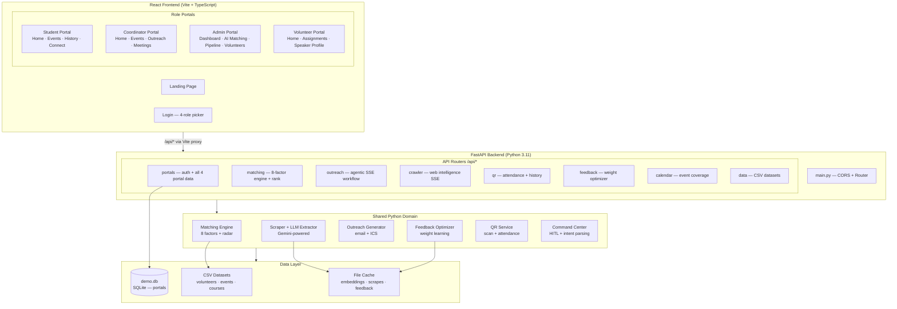

# Hackathon for a Better Future 2026

> **Category 3 — IA West Smart Match CRM**  
> AI-orchestrated speaker-event matching platform for the Insights Association West Chapter.

---

## Overview

The IA West Smart Match CRM uses a multi-agent AI pipeline to discover university engagement opportunities, rank board member volunteers via an 8-factor scoring algorithm, and coordinate outreach through a voice-enabled command center. It ships as a full-stack React + FastAPI application with four role-specific portals.

---

## System Architecture



---

## User Portals

| Portal | Role | Entry URL | Key Capabilities |
|--------|------|-----------|-----------------|
| **Student** | Student / attendee | `/student-portal` | Event recommendations, attendance history, peer connections, retention nudges |
| **Event Coordinator** | Course coordinator | `/coordinator-portal` | Event management, AI outreach agents, meeting scheduling, thread tracking |
| **IA Admin** | IA West staff | `/dashboard` | Full AI Matching, volunteer recovery map, pipeline funnel, web crawler feed |
| **Volunteer / Speaker** | Board member / speaker | `/volunteer-portal` | Assignment tracker, match score, speaker profile, recovery status |

All portals use mock login (`POST /api/portals/auth/mock-login`) backed by `data/demo.db`. Deep-link to a role via `?role=student|event_coordinator|ia_admin|volunteer`.

---

## Feature Highlights

- **8-Factor AI Matching Engine** — scores expertise, availability, geography, course alignment, volunteer fatigue, board role, and pipeline history; interactive weight tuner + radar chart
- **Agentic Outreach Pipeline** — five named agents (Scout → Copywriter → Scheduler → Planner → Pipeline) stream over SSE to the coordinator portal
- **Voice Command Center** — Gemini intent parsing, TTS/STT (KittenTTS + faster-whisper), human-in-the-loop approval cards, background tool dispatch
- **Web Intelligence Feed** — Gemini-grounded + Tavily web crawler streams discovered events via SSE; configurable seed URLs
- **QR Attendance** — generates QR codes, logs check-ins, surfaces attendance history per student
- **Feedback-Driven Learning** — coordinator accept/decline signals optimize matching weights; pain score + acceptance rate dashboard
- **Four Role Portals** — student, coordinator, IA admin, and volunteer workspaces on the same React app
- **Demo DB** — fully seeded `demo.db` with synchronized students, events, registrations, outreach threads, meetings, and volunteer assignments
- **580+ tests** — pytest suite covering matching engine, API routers, portals, QR, and outreach flows

---

## Tech Stack

| Layer | Technology |
|-------|-----------|
| Frontend | React 18, Vite 6, TypeScript, React Router v7, Tailwind CSS, Radix UI / shadcn, Framer Motion, Recharts |
| Backend API | FastAPI, Pydantic, Uvicorn, SQLite (demo.db) |
| AI / LLM | Google Gemini API (text + embeddings), KittenTTS, faster-whisper |
| Python tools | scikit-learn, pandas, Plotly, qrcode, httpx, tavily-python |
| Testing | pytest, pytest-cov (580+ tests) |
| Deploy | Vercel (frontend + Python serverless functions) |
| Dev tooling | Makefile, PowerShell/Bash launch scripts, Playwright (E2E) |

---

## Quick Start

**React + FastAPI (recommended — the full demo path):**

```bash
# Windows PowerShell
powershell -ExecutionPolicy Bypass -File .\start_cat3_fullstack.ps1

# Windows CMD
start_cat3_fullstack.cmd

# WSL2 / Linux
chmod +x ./start_cat3_fullstack.sh && ./start_cat3_fullstack.sh
```

This opens:
- **React UI**: http://127.0.0.1:5173
- **FastAPI backend**: http://127.0.0.1:8000/api/health

Optional flags: `--skip-install`, `--force-install`, `--full-install`, `--no-browser`, `--frontend-port <n>`, `--backend-port <n>`

---

## Environment Setup

### Prerequisites

- Python 3.11+ (3.11–3.12 recommended for full KittenTTS voice support)
- Node.js 18+ and npm
- Git

### Python virtualenv

```bash
# WSL2 / Linux / macOS
cd "Category 3 - IA West Smart Match CRM"
python3 -m venv .venv
.venv/bin/pip install -U pip
.venv/bin/pip install -r requirements-fullstack.txt   # React+FastAPI path
# or: pip install -r requirements.txt                 # includes Streamlit+voice stack
cp .env.example .env
# Edit .env and set GEMINI_API_KEY (optional for Demo Mode)
```

```powershell
# Windows PowerShell
cd "Category 3 - IA West Smart Match CRM"
py -3 -m venv .venv
.\.venv\Scripts\pip.exe install -U pip
.\.venv\Scripts\pip.exe install -r requirements-fullstack.txt
copy .env.example .env
```

### Seed the demo database

```bash
python scripts/seed_demo_db.py
```

Builds `data/demo.db` with synchronized students, coordinators, volunteers, events, registrations, outreach threads, meetings, and QR/attendance records.

### Frontend (if running manually)

```bash
cd "Category 3 - IA West Smart Match CRM/frontend"
npm install
npm run dev
```

---

## Environment Variables

See [`Category 3 - IA West Smart Match CRM/.env.example`](Category%203%20-%20IA%20West%20Smart%20Match%20CRM/.env.example).

| Variable | Required | Description |
|----------|----------|-------------|
| `GEMINI_API_KEY` | For live LLM/embeddings | Google Gemini API key |
| `GEMINI_TEXT_MODEL` | No | Defaults in `.env.example` |
| `GEMINI_EMBEDDING_MODEL` | No | Defaults in `.env.example` |
| `TAVILY_API_KEY` | No | Enables Tavily fallback in web crawler |
| `USE_NEMOCLAW` | No | `0`/`1` — optional NemoClaw orchestration hook |
| `NVIDIA_NGC_API_KEY` | If `USE_NEMOCLAW=1` | NVIDIA NGC key |

> Enable **Demo Mode** in the UI sidebar to run fully offline without any API key.

---

## API Reference

All endpoints are served at `http://localhost:8000` (local dev). Interactive docs: `http://localhost:8000/docs`.

| Router prefix | Description |
|--------------|-------------|
| `GET /api/health` | Health check |
| `/api/portals/...` | Student, coordinator, and volunteer portal data; mock auth (`POST /api/portals/auth/mock-login`) |
| `/api/matching/...` | 8-factor speaker ranking, batch rank, factor weights |
| `/api/outreach/...` | Agentic outreach SSE workflow (`POST /api/outreach/agentic-workflow/stream`) |
| `/api/crawler/...` | Web intelligence crawler SSE feed, seed URL management |
| `/api/qr/...` | QR code generation, attendance check-in, history |
| `/api/feedback/...` | Coordinator feedback submission, weight optimization stats |
| `/api/calendar/...` | Event coverage calendar, recovery posture |
| `/api/data/...` | Raw CSV dataset access (volunteers, events, courses) |

---

## Testing

```bash
# From Category 3 - IA West Smart Match CRM/
.venv/bin/python -m pytest -q

# With coverage report
.venv/bin/python -m pytest --cov=src --cov-report=term-missing
```

580+ tests cover: matching engine, all API routers, portal flows (student/coordinator/volunteer), QR service, outreach generation, and feedback optimizer.

---

## Project Structure

```
HackathonForBetterFuture2026/
├── README.md                          # This file
├── vercel.json                        # Vercel deployment config
├── Makefile                           # Common dev commands
├── .env.example                       # Root env template
├── start_cat3_fullstack.*             # Quick-launch scripts (PS1/CMD/SH)
│
├── Category 3 - IA West Smart Match CRM/
│   ├── README.md                      # Detailed setup + feature guide
│   ├── requirements.txt               # Full Python deps (includes voice stack)
│   ├── requirements-fullstack.txt     # Slim deps for React+FastAPI path
│   ├── .env.example                   # Environment variable template
│   │
│   ├── src/                           # Python application
│   │   ├── app.py                     # Streamlit entry point (legacy UI)
│   │   ├── api/                       # FastAPI app + 8 routers
│   │   │   ├── main.py
│   │   │   └── routers/               # portals · matching · outreach · crawler · qr · feedback · calendar · data
│   │   ├── matching/                  # 8-factor scoring engine
│   │   ├── scraping/                  # University event scraper
│   │   ├── extraction/                # LLM-powered event extraction
│   │   ├── outreach/                  # Email + ICS generation
│   │   ├── coordinator/               # HITL command center + tool dispatch
│   │   ├── feedback/                  # Weight optimizer
│   │   ├── qr/                        # QR code + attendance service
│   │   └── voice/                     # TTS/STT wrappers
│   │
│   ├── frontend/                      # Vite + React (TypeScript)
│   │   └── src/app/
│   │       ├── pages/                 # Dashboard · AIMatching · Volunteers · Pipeline · Outreach
│   │       │   ├── coordinator/       # CoordinatorHome · Events · Outreach · Meetings
│   │       │   ├── student/           # StudentHome · Events · History · Connect
│   │       │   └── volunteer/         # VolunteerHome · Assignments · Profile
│   │       ├── components/            # Layout shells (Layout, StudentPortalLayout, VolunteerPortalLayout, …)
│   │       ├── routes.tsx             # Browser router — all portals
│   │       └── lib/api.ts             # Typed API client (all fetch helpers + TypeScript contracts)
│   │
│   ├── data/                          # CSV datasets + demo.db
│   ├── cache/                         # Embedding + scrape caches
│   ├── tests/                         # pytest suite (580+ tests)
│   ├── scripts/                       # seed_demo_db.py, start scripts, Playwright QA
│   └── docs/                          # Architecture · API · deliverables · testing · demo narratives
│       ├── README.md                  # Documentation index
│       ├── architecture/              # System design + ADRs
│       ├── api/                       # API reference
│       ├── deliverables/              # Business deliverables (growth, measurement, responsible AI)
│       ├── testing/                   # Test plans, E2E reports, bug log
│       └── history/                   # Sprint plans, code reviews, audit reports
│
├── docs/                              # Repo-level governance
│   └── governance/                    # Canonical map, repo reference, audit reports
│
└── archived/                          # Other hackathon category entries (reference)
```

---

## Documentation

| Document | Description |
|----------|-------------|
| [Category 3 README](Category%203%20-%20IA%20West%20Smart%20Match%20CRM/README.md) | Detailed setup, run modes, and feature walkthrough |
| [Demo Narrative](Category%203%20-%20IA%20West%20Smart%20Match%20CRM/docs/demos/demo-narrative-2026-04-14.md) | Six-scene judge walkthrough with verification snapshot |
| [Demo Script (5 min)](Category%203%20-%20IA%20West%20Smart%20Match%20CRM/docs/demos/demo-script-5min.md) | Presentation guide |
| [PRD](PRD_SECTION_CAT3.md) | Full product requirements document |
| [Architecture](Category%203%20-%20IA%20West%20Smart%20Match%20CRM/docs/architecture/) | System design, data flow, component roles |
| [API Reference](Category%203%20-%20IA%20West%20Smart%20Match%20CRM/docs/api/) | All endpoint documentation |
| [Deliverables](Category%203%20-%20IA%20West%20Smart%20Match%20CRM/docs/deliverables/) | Growth strategy, measurement plan, responsible AI note |
| [E2E Tests](Category%203%20-%20IA%20West%20Smart%20Match%20CRM/docs/E2E_TESTS.md) | End-to-end test coverage doc |
| [Voice / WebRTC](Category%203%20-%20IA%20West%20Smart%20Match%20CRM/docs/demos/UAT-VOICE-MIC.md) | UAT guide for mic + TTS features |

---

## License

Hackathon competition entry — all rights reserved.
